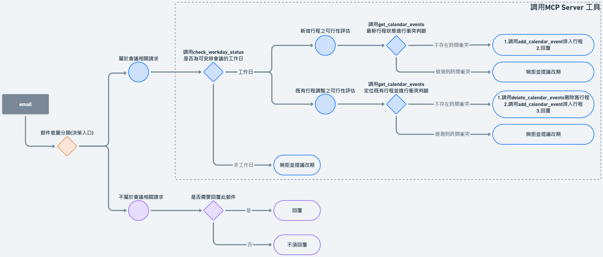

# TL;DR(設計重點摘要)

- 此專案實作一個具備自主決策能力的個人電子郵件代理人，能自動完成郵件分類、優先級判定與會議排程決策
- Agent不直接操作資料檔案，所有行程查詢、新增與刪除皆透過 MCP Server 封裝的工具進行，確保狀態變更可追蹤且一致
- 所有決策流程皆具備 可解釋性：每封郵件的分類、推理依據、工具呼叫與最終行動，皆可透過 agent_final_results.json 與 decision_actions.log 完整追溯
- 此專案將 LangChain 作為 OpenAI SDK 的呼叫介面使用，透過 ainvoke 與 bind_tools 進行 LLM 呼叫與工具綁定，未採用任何 Agent Executor 或狀態管理框架
- 系統支援智慧會議預約，能在多封郵件依序處理的情境下，即時感知 最新行程狀態，並正確處理時間衝突與改期需求
- 日期判斷(含週末與農曆除夕)不依賴 LLM 常識推論，而是由 MCP Server 查詢 臺北市政府行政機關辦公日曆後回傳具體原因，作為 Agent 的決策依據
- 系統內建防幻覺與安全護欄，僅在郵件被明確判定為「會議邀約」時才允許排程操作，並避免未經授權的合約或金錢承諾


# Agent 決策流程

1. 意圖與需求識別: Agent 優先對郵件進行分類，區分出「單純資訊(不需排程)」與「行程請求(需調用排程工具)」

2. 外部環境限制檢查: 針對會議請求，Agent 必須先調用 check_workday_status，這是為了將「非工作日(如週末或除夕)」視為不可逾越的硬限制，在此階段若判定為非工作日，Agent 將直接中斷排程嘗試並轉入「婉拒/提議改期」邏輯，確保決策符合常識

3. 即時行程狀態評估: 僅在通過日期檢查後，Agent 才會調用 get_calendar_events
- 新增行程: 直接比對時間重疊。
- 既有變更(EM013): 執行「先刪除、後新增」的操作，確保 calendar 檔案的狀態始終保持最新。 

4. 時序推理與衝突處理: Agent 在每一輪處理前都會重新查詢行程。確保當連續處理多封郵件時(如 EM013 與 EM014)，Agent 能偵測到「之前才產生」的新衝突，從而做出正確的婉拒判斷 

5. 一致性確保： 所有資料異動完全透過 MCP Server 工具介接，Agent 被限制不得繞過工具直接操作 calendar.json，藉此確保決策過程的可追蹤性與資料完整性




# 專案架構說明

### 執行產出
- **calendar.json**: 紀錄 Agent 增刪後的行程最終狀態 (MCP Server 操作對象; 經 Agent 執行更新之檔案)
- **decision_actions.log**: 決策路徑紀錄檔案 (執行後生成的檔案)
- **agent_final_results.json**: 郵件分類結果與回覆內容 (執行後生成的檔案)

### 核心程式碼
- **agent.py**: 主程式，負責多步推理與工具調度核心
- **server.py**: MCP Server 封裝行程表管理工具
- **prompt_set.py**: 存放 email_system_prompt，定義 Agent 的決策行為準則
- **llm_setting.py**: LLM 配置與 Pydantic 結構化輸出定義

### 基礎事實與資料
- **emails.json**: 模擬待處理的電子郵件原始數據
- **calendar_2026_process.csv**: 2026 年臺北市政府行政機關辦公日曆表

### 環境配置
- **pyproject.toml**: uv 套件管理與 Python 版本定義
- **uv.lock**: 確保開發與部署環境的依賴一致性


# 如何啟動程式 & MCP Server

- 在此專案中，採用 uv 作為套件管理工具，並使用 LangChain OpenAI 整合 Azure OpenAI Service (GPT-4o)
- 請依照以下步驟啟動系統:

## 1. 憑證與環境變數配置

### 將目錄下的 .env.example 重新命名為 .env

**在 `.env` 中填入您的 Azure OpenAI 憑證:**
```env
AZURE_OPENAI_API_KEY=your_api_key_here
AZURE_OPENAI_ENDPOINT=https://your-resource-name.openai.azure.com/
OPENAI_API_VERSION=2024-12-01-preview
AZURE_DEPLOYMENT=your_deployment_name
```


## 2. 環境初始化

### 環境需求(Prerequisites)

- **Python 3.8 以上**(僅用於初次安裝 uv 工具本身)
- **專案執行環境**: Python 3.10(由 uv 自動管理)


### 安裝 uv(若系統尚未安裝)

- 若系統已具備 Python 3.8 以上版本，可直接透過 pip 安裝:

```bash
pip install uv==0.9.28
```


<details>
<summary>或使用 uv 官方提供的安裝腳本(可能受防火牆或權限限制)</summary>

**Windows(PowerShell)**
```powershell
powershell -ExecutionPolicy ByPass -c "irm https://astral.sh/uv/install.ps1 | iex"
```

**macOS / Linux**
```bash
curl -LsSf https://astral.sh/uv/install.sh | sh
```
</details>


### 初始化專案環境
- 執行以下指令，uv 會自動下載 Python 3.10 並建立虛擬環境，依據專案內既有的相依設定建立虛擬環境與安裝套件
- 由於專案目錄中已包含 `pyproject.toml` 與 `uv.lock`
- 所有套件相依與版本鎖定皆以此為準，因此無需再透過 `requirements.txt` 重新建置環境
- `uv sync` 會依照 lock 檔內容自動安裝對應套件版本，確保環境可重現性與一致性


```bash
uv venv --python 3.10
uv sync
```

> **說明:** `uv venv --python 3.10` 會自動下載並配置 Python 3.10，無需手動安裝
>
> **虛擬環境:** 執行指令後將自動生成 .venv 資料夾。這是一個專案專屬且完全隔離的 Python 虛擬環境，確保相依套件版本的一致性
>
> **備註:** 為兼顧工具相容性與閱讀便利性，專案仍附上 `requirements.txt`，僅作為傳統 pip 安裝的參考清單，實際環境建議以 `uv` 為主


## 3. 啟動 MCP Calendar Server(Terminal 1)

啟動行程表服務端，負責讀取 calendar.json 與 calendar_2026_process.csv:

```bash
uv run server.py
```

## 4. 執行 Email Agent 主程式(Terminal 2)
```bash
uv run agent.py
```

### 執行後產出檔案

執行完成後，會更新或生成以下三個檔案:

| 檔案名稱 | 說明 | 內容 |
|---------|------|------|
| `calendar.json` | 更新後的行程表 | 反映所有會議新增、刪除或修改後的最新行程狀態 |
| `agent_final_results.json` | 決策與推理過程 | 包含所有郵件的分類、優先級、建議回覆及行程變更紀錄 |
| `decision_actions.log` | 系統執行日誌 | 記錄 Agent 的推理步驟、工具呼叫順序及中間決策邏輯 |


### agent_final_results.json 欄位說明

- **id**：郵件編號  
- **category**: 郵件意圖分類結果  
- **priority**: 處理優先級(1–5 分)  
- **reasoning**: 決策依據與判斷邏輯摘要  
- **suggested_reply**: 建議回覆內容(無須回覆則為空字串)
- **executed_actions**: MCP Server工具調用紀錄，若該郵件不涉及日曆操作，則此欄位為空陣列


# Agent 處理邏輯與 13 封郵件執行成果

- 此專案已完整自動化處理題目所提供之 13 封測試郵件(EM001–EM013)，並透過系統執行日誌，Agent 在面對複雜的「日期陷阱」情境時，仍能依照既定流程做出一致且可解釋的決策
- 此外，為呼應題目中提及的「多輪時序衝突判斷」情境，專案額外新增 EM014 作為延伸測試案例(非原題目要求)，用以驗證 Agent 是否能在**前一封郵件已成功更新行程的前提下**，於後續郵件中正確感知最新狀態並再次進行衝突判斷


## 1. 執行結果總覽 (Summary Table)
系統依據郵件內容自動判斷類別與優先級，並精確執行行程表操作:

| 郵件 ID | 主題簡述 | 分類 | 優先級 | 行動與決策核心 |
| :--- | :--- | :--- | :---: | :--- |
| **EM001** | 緊急數據修正 | 急件 | 5 | 判定為高優先行動請求，不涉及會議或排程處理 |
| **EM002** | 1/20 合作洽談 | 會議邀約 | 3 | **偵測行程衝突**: 行程表中在1/20 已有「AI 峰會」，自動婉拒並建議改期 |
| **EM009** | Uber 收據 | 一般 | 2 | **靜默原則**: 無須行動，建議回覆為空字串 |
| **EM011** | 2/16 產品討論 | 會議邀約 | 3 | **假日陷阱**: 辨識 2/16 為農曆除夕(放假日)，不予排程，回覆說明原因並請對方提供其他工作日時段 |
| **EM013** | 會議改期請求 | 會議邀約 | 3 | **順序化行程更新**: 確認 1/23 為工作日且無衝突，先移除 1/27 原行程，後建立 1/23 新行程 |
| **EM014 (自行新增的郵件)** | 產品發展會議邀約 | 會議邀約 | 3 | **多輪時序衝突判斷**: 確認 1/23 為工作日後，查詢最新行程狀態，偵測與 EM013 新增之 14:00–16:00 行程於 15:30–16:00 重疊，自動婉拒並建議改期 |
---

## 2. 深度剖析: 日期陷阱 (國定假日) 決策流程

Agent 在處理 **EM011** 時，成功辨識 2026-02-16 為國定假日(農曆除夕)，因此未建立該會議行程，並自動產生專業回覆說明原因，請對方提供其他可行的工作日時段

**決策路徑記錄 (節錄自 `decision_actions.log`):**

1. **提取資訊**: 從郵件內容中提取會議邀約資訊，包含會議日期 `2026-02-16`，開始時間為上午 10:00，並依預設規則推理會議結束時間為 11:00
2. **工具調用 (Tool Call)**: 呼叫 `check_workday_status`，傳入參數 `{'date_str': '2026-02-16'}`，以確認該日期是否為可安排會議的工作日
3. **觀察環境 (Observation)**: MCP Server 讀取 `calendar_2026_process.csv`，回傳 `2026-02-16` 為 **「農曆除夕」**，屬於非工作日
4. **邏輯推理 (Reasoning)**: Agent 判定該會議時間落於法定放假日，不符合一般商務會議安排條件，故不建立行程並回覆請對方提供其他可行的工作日時段
5. **最終行動 (Action)**: 產生專業回覆內容，說明該日為放假日，婉拒會議邀約並請對方提供其他可行的工作日時段

---

## 3. 深度剖析: 順序化行程更新

針對 **EM013** 的改期要求，透過檢查最終產出的 `calendar.json`，可以看到原本 1/27 的行程已移除，並正確寫入 1/23 的新行程

**決策路徑實錄 (節錄自 `decision_actions.log`):**

1. **提取資訊**: 從郵件內容提取新的會議時間為 `2026-01-23 14:00–16:00`，並辨識此為既有會議之改期請求
2. **工具調用 (Tool Call)**: 呼叫 `check_workday_status`，確認 `2026-01-23` 是否為工作日
3. **觀察環境 (Observation)**: MCP Server 回傳 `2026-01-23` 為一般工作日，允許進行會議安排
4. **工具調用 (Tool Call)**: 呼叫 `get_calendar_events` 取得現有行程，確認新時段未與其他行程發生衝突
5. **邏輯推理 (Reasoning)**: Agent 判定新會議時間有效且無衝突，Agent 依序執行既有行程的刪除與新增，以完成改期
6. **工具調用 (Tool Call)**:  
   - 先呼叫 `delete_calendar_events`，移除原定於 `2026-01-27` 的「合作廠商會議 (partner_2)」
   - 再呼叫 `add_calendar_event`，將同一會議新增至 `2026-01-23 14:00–16:00`
7. **最終行動(Action)**: 完成行程更新，並產生回覆文字，通知對方會議已成功改期


## 4. 深度剖析: 動態衝突偵測(時序推理)
針對 **EM014** 的會議邀約，目的在測試 Agent 是否能偵測到由前一項任務 **EM013** 所引發的動態行程衝突，儘管在原始日曆中該時段為空白，但 Agent 必須感知到環境狀態的即時改變

**決策路徑實錄 (節錄自 `decision_actions.log`):**

1. **提取資訊**: 辨識郵件內容為新會議邀約，時間請求為 `2026-01-23 15:30–18:00`
2. **工具調用 (Tool Call)**: 呼叫 `check_workday_status`，確認 `2026-01-23` 是否為工作日
3. **觀察環境 (Observation)**: MCP Server 回傳 `2026-01-23` 為一般工作日，允許進行會議安排
4. **工具調用 (Tool Call)**: 呼叫 `get_calendar_events` 檢查最新型程狀態，此時 MCP Server 回傳之行程表已包含前一輪 **EM013** 剛寫入的「合作廠商會議 (14:00–16:00)」
5. **邏輯推理 (Reasoning)**: Agent 判定新會議時間15:30 開始，與 **EM013** 的會議時間 14:00–16:00 有重疊
7. **最終行動(Action)**: 產生建議回覆，告知對方該時段已有安排，並主動詢問其他可行時段


# 如何處理「除夕與週末」的推理判斷邏輯 (日期陷阱處理手法)

在 `server.py` 中，設有「假日感知」能力的函式，確保 Agent 不會在除夕或週末等假日誤排行程

## 1. 資料來源
* **臺北市政府公開資料平台**: [臺北市政府行政機關辦公日曆表](https://data.taipei/dataset/detail?id=c30ca421-d935-4faa-b523-9c175c8de738)
- 基礎事實來源: 系統載入 `calendar_2026_process.csv` 作為唯一的日期事實來源，用於假日與工作日判斷
- 非商務紀念日排除: 於資料預處理階段，排除僅具紀念性、但不影響一般工作日安排之節日(如警察節、軍人節)，避免其進入後續推理條件
- 判定邊界定義: 推理邏輯僅針對實際影響商務運作的非工作日進行判斷，包含法定國定假日(如除夕)與週末(週六、週日)
- 設計考量: 透過明確限縮判斷條件，避免系統僅依節日名稱進行推論，確保在實際工作日情境下仍能正常進行會議安排


## 2. 外部工具比對邏輯 (`is_valid_working_day`)
此函數將原本 LLM 不具備的「行政機關辦公日曆表」知識，透過 CSV 檢索轉化為 Agent 的決策依據:

* **假日判定**: 串接 `calendar_2026_process.csv`，精確識別國定假日、週末及各類彈性放假
* **原因回傳**: 當遇到假日時，不只回傳 `False`，更會抓取 CSV 中的 `holidayCategory`(如:「農曆除夕」)，讓 Agent 產出的回信能具體說明原因


```python
GOV_CALENDAR = pd.read_csv('./calendar_2026_process.csv' , index_col = 0)
GOV_CALENDAR['Date'] = GOV_CALENDAR.index.astype(str)
GOV_CALENDAR['Date'] = GOV_CALENDAR['Date'].apply(lambda x: parser.parse(x).date())
HOLIDAY = GOV_CALENDAR['Date'].tolist()

def is_valid_working_day(date_str):
    """
    2027年之後暫無公布政府行政機關辦公日曆表，暫以是否為週末當作判斷工作日依據
    """
    if not date_str:
        return False , "無日期資訊"
    try:
        dt = parser.parse(date_str).date()
        if dt.year == 2026:
            if dt in HOLIDAY:
                holidayCategory = GOV_CALENDAR.loc[GOV_CALENDAR['Date'] == dt , 'holidayCategory'].iloc[0]
                return False , holidayCategory
            return True, "工作日可安排。"
        elif dt.year > 2026: 
            if dt.weekday() >= 5:
                return False, "週末"
            else:
                return True, "工作日可安排。"
        
    except Exception as e:
        return False , f"日期解析錯誤: {e}"    
```

> **備註:** 由於 2027 年之後之政府行政機關辦公日曆表尚未公布，此專案在 2027 年 以後的工作日判斷，暫時依據是否為週末，作為工作日基礎判準


## 3. MCP Tool 定義 (`check_workday_status`)

```python
@mcp.tool()
def check_workday_status(date_str: str) -> str:
    """
    檢查特定日期是否為工作日
    Agent 在提取郵件日期後，必須先呼叫此工具確認該日是否為週末或除夕
    """
    is_work , reason = is_valid_working_day(date_str)
    return "OK" if is_work else f"FAIL: {reason}"
```


# 如何設計 Prompt 或 Workflows 來避免模型幻覺


## 1. email_system_prompt => Task 2 防幻覺說明 

重點在於避免模型在不確定情境下自行推測並產生錯誤行為

1. 僅在郵件被明確判定為「會議邀約」時，才允許呼叫 MCP 工具，避免模型因看到日期或時間就擅自排程
2. 將「週末、除夕等日期判斷」交由外部工具驗證，並非依賴模型內建的常識記憶，降低時間判斷錯誤的風險
3. 強制依序執行日期驗證與衝突檢查，避免模型跳步做出決策
4. 改期流程中要求先清除舊行程再新增新行程，避免舊行程殘留導致後續衝突


## 2. email_system_prompt => Task 3 防幻覺說明 

目的在於約束模型的輸出行為，避免在不確定或無依據的情況下自行補充事實或做出越權回應

1. 強制 `reasoning` 根據實際工具回傳結果與郵件內容，避免模型編造推理過程
2. 僅能使用郵件中明確出現的名稱或 Email，防止模型自行假設身份或職稱，最後能避免自動回覆內容有不適當的回覆
3. 嚴禁使用佔位符與自行提議日期時間，避免模型產生看似合理但未被授權的內容
4. 嚴禁使用佔位符(如 `[您的姓名]`、`[職位]` 等)，避免使用者在未察覺內容未完成的情況下直接寄出郵件，造成專業形象受損
5. 禁止模型自行提議具體日期或時間，避免在未完整驗證行程與假日狀態下提出不合適時段(如再次落在假日)，造成回覆顯得不專業
6. 僅在需要行動或互動時才回覆，其餘情境強制靜默，避免模型在不需要回應時多說或亂說


## 3. 安全與護欄

目的在於防止 Agent 在未經授權下做出合約/金錢承諾
- 可以在EM007觀察到，回覆內容有根據 email_system_prompt 要求，僅限於確認需求、表達後續由人工準備報價，避免生成具體金額、條款或承諾性語句